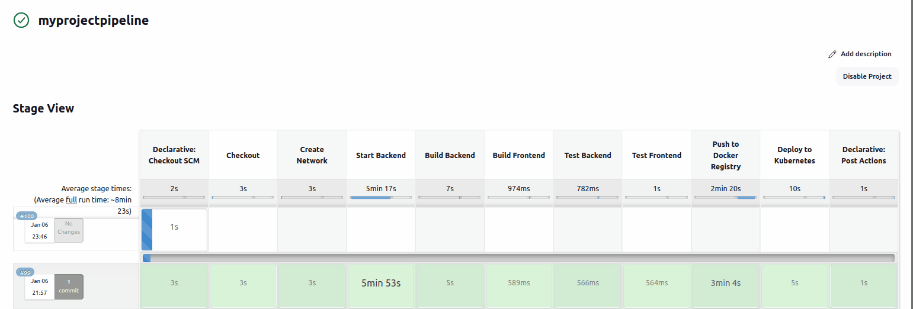
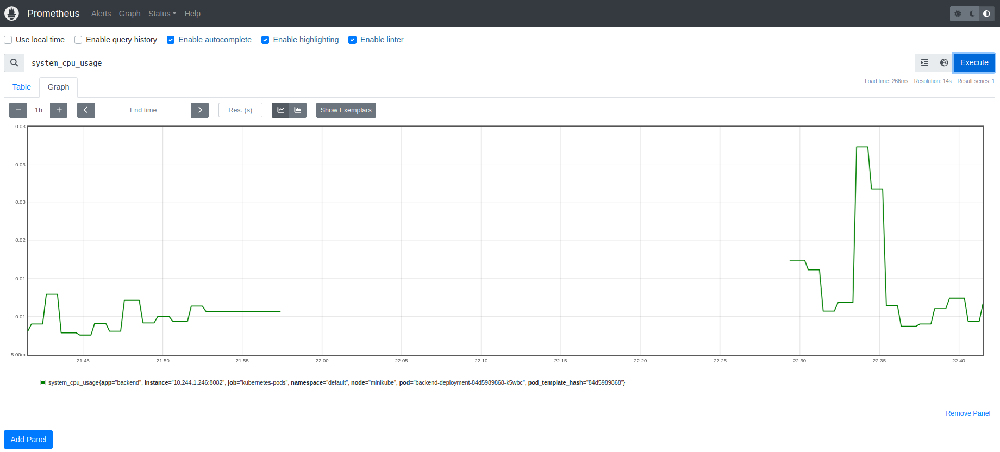
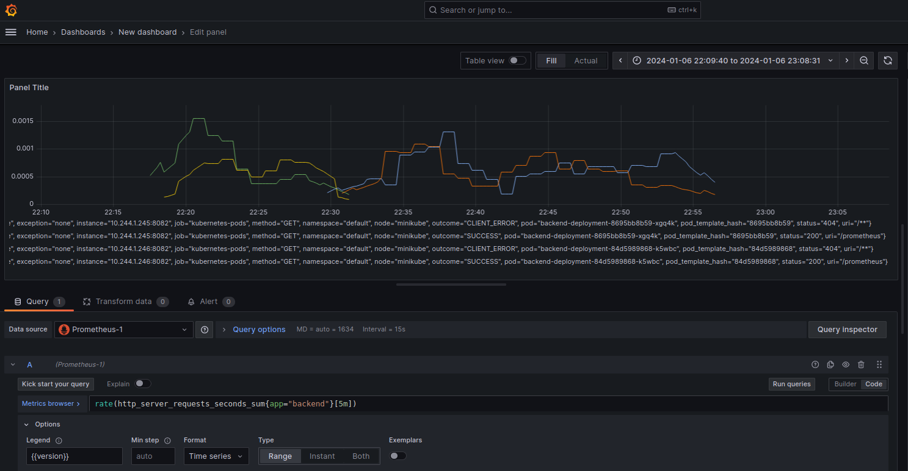
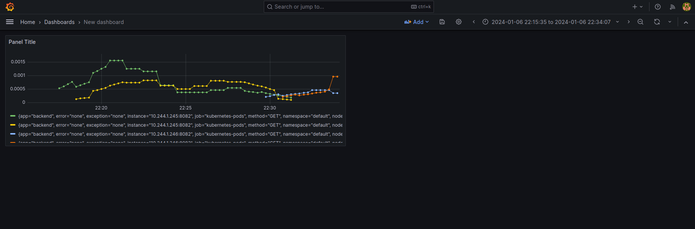

# Library Management System

## Overview
This mini-project demonstrates a complete DevOps pipeline, including Docker containerization, Jenkins CI/CD, basic unit testing, and Kubernetes deployment for a web application with a React.js TypeScript frontend and a Spring Boot backend. The project incorporates Prometheus for metrics and Grafana for monitoring, exemplifying a full-stack DevOps setup.

## Project Architecture


The application architecture consists of a React.js TypeScript frontend communicating with a Spring Boot backend, which interacts with a MySQL database for data persistence. Docker is used for containerization of both the frontend and backend services.

## Dockerization

### Backend Dockerfile
```Dockerfile
FROM openjdk:11-jdk-slim

WORKDIR /app

COPY mvnw .
COPY .mvn .mvn

COPY pom.xml .

COPY src src

RUN ./mvnw package -DskipTests

EXPOSE 8082

CMD ["java", "-jar", "target/library_backend-0.0.1-SNAPSHOT.jar"]
```
### Frontend Dockerfile
```Dockerfile
FROM node:16-alpine as build

WORKDIR /app

COPY package*.json ./

RUN npm install

COPY . .

RUN npm run build

FROM nginx:alpine

COPY --from=build /app/build /usr/share/nginx/html

EXPOSE 80
```
### Jenkins Pipeline



My Jenkins pipeline defines the entire lifecycle of my application, from building images to deploying them.

## Pipeline Stages
Checkout: Clones the code.
Build Backend & Frontend: Constructs Docker images.
Unit Tests: Placeholder for unit tests.
Push to Docker Registry: Uploads images to Docker Hub.
Deploy to Kubernetes: Applies Kubernetes manifests.

``` Jenkinsfile
pipeline {
    agent any

    environment {
        DOCKER_IMAGE_BACKEND  = "amenyelokb/library_backend:latest"
        DOCKER_IMAGE_FRONTEND = "amenyelokb/react-library:latest"
        KUBECONFIG_CREDENTIALS_ID = 'jenkins-sa'
        KUBECONFIG = "/var/lib/jenkins/kubeconfig"
        
    }
    
    stages {
        stage('Checkout') {
            steps {
                checkout scm
            }
        }

        stage('Create Network') {
    steps {
        script {
            sh 'docker network ls | grep my_network || docker network create my_network'
        }
    }
}

        stage('Start Backend') {
    steps {
        script {
            sh 'docker build -t my-backend ./library_backend'
            sh """
            docker run -d \
              --network=my_network \
              --name backend \
              -e SPRING_DATASOURCE_URL=jdbc:mysql://db:3306/reactlibrarydatabase \
              -e SPRING_DATASOURCE_USERNAME=root \
              -e SPRING_DATASOURCE_PASSWORD=root \
              -p 8082:8082 \
              my-backend
            """
        }
    }
}
        stage('Build Backend') {
            steps {
                script {
                    dir('library_backend') {
                        echo 'Build started successfully'
                        sh 'docker build -t $DOCKER_IMAGE_BACKEND .'
                        echo 'Build completed successfully'

                    }
                }
            }
        }
        stage('Build Frontend') {
            steps {
                script {
                    dir('react-library') {
                        sh 'docker build -t $DOCKER_IMAGE_FRONTEND .'
                    }
                }
            }
        }
       stage('Test Backend') {
            steps {
                script {
                    dir('library_backend') {
                        // Running backend tests
                      //  sh 'docker run --rm $DOCKER_IMAGE_BACKEND java -jar app.jar test'
                    }
                }
            }
        }
        stage('Test Frontend') {
            steps {
                script {
                    dir('react-library') {
                        // Running frontend tests
                       // sh 'docker run --rm $DOCKER_IMAGE_FRONTEND npm test'
                    }
                }
            }
        }
        stage('Push to Docker Registry') {
            steps {
                script {
                    docker.withRegistry('https://registry.hub.docker.com', 'dockerhub-credentials') {
                        docker.image("$DOCKER_IMAGE_BACKEND").push()
                        docker.image("$DOCKER_IMAGE_FRONTEND").push()
                    }
                }
            }
        }
      stage('Deploy to Kubernetes') {
            steps {
                script {
                        sh 'kubectl apply -f k8s/backend/backend-deployment.yaml'
                        sh 'kubectl apply -f k8s/backend/backend-service.yaml'
                        sh 'kubectl apply -f k8s/frontend/frontend-deployment.yaml'
                        sh 'kubectl apply -f k8s/frontend/frontend-service.yaml'
                }
            }
        }

}
    post {
        always {
            echo 'Performing post-build actions for both frontend and backend'
            sh 'docker rm -f frontend backend db || true'
            sh 'docker network rm my_network || true'
        }
    }
}
```
### Kubernetes Deployment
frontend :

backend : 


Deployment is managed through Kubernetes, providing scalability and high availability.

## Automated Deployment with Jenkins
The Jenkinsfile includes steps for Kubernetes deployment using manifests.

## Manual Kubernetes Deployment
Use the following commands to manually deploy the application:
```
kubectl apply -f k8s/backend-deployment.yaml
kubectl apply -f k8s/backend-service.yaml
kubectl apply -f k8s/frontend-deployment.yaml
kubectl apply -f k8s/frontend-service.yaml
kubectl apply -f k8s/mysql.yaml
```
### Prometheus Monitoring


Prometheus is used for monitoring my application by scraping metrics exposed by the Spring Boot backend.

## Prometheus Configuration
The prometheus.yml configuration file includes the scrape settings for our application.
```
global:
  scrape_interval: 15s

scrape_configs:
  - job_name: 'spring-boot'
    metrics_path: '/prometheus'
    static_configs:
      - targets: ['backend-service:8082']
```

### Grafana Dashboard
Grafana visualizes metrics collected by Prometheus. Access the dashboard via http://localhost:3000 and log in with the default credentials.



## Conclusion

The Library Management System project encapsulates the essence of modern DevOps practices. Through the integration of a React.js TypeScript frontend and a Spring Boot backend, it presents a scalable and robust full-stack application. The utilization of Docker containers ensures consistent environments across development, testing, and production, while the Jenkins CI/CD pipeline automates the process from code integration to deployment.

Kubernetes orchestration offers a resilient and scalable cloud-native deployment solution, showcasing the project's readiness for high-availability production environments. Prometheus and Grafana complement this setup by providing a powerful monitoring and visualization stack, critical for maintaining operational excellence.

With this project, I demonstrate not only the technical integration of various DevOps tools and practices but also the cultural shift towards increased collaboration, shared responsibility, and quality assurance throughout the application lifecycle. It serves as a practical example for those looking to understand or implement DevOps methodologies in their own projects.


