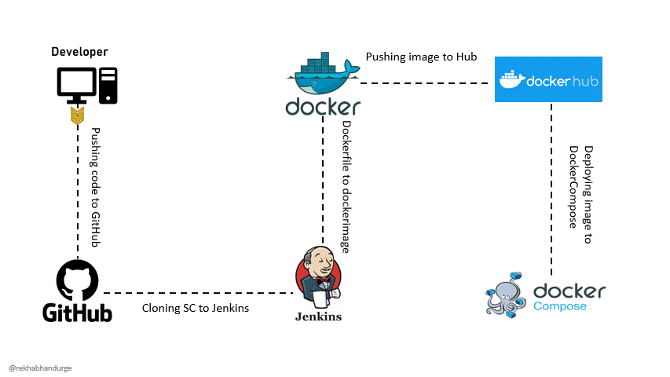

# Library Management System

## Overview
This mini-project demonstrates a complete DevOps pipeline, including Docker containerization, Jenkins CI/CD, basic unit testing, and Kubernetes deployment for a web application with a React.js TypeScript frontend and a Spring Boot backend. The project incorporates Prometheus for metrics and Grafana for monitoring, exemplifying a full-stack DevOps setup.

## Project Architecture


The application architecture consists of a React.js TypeScript frontend communicating with a Spring Boot backend, which interacts with a MySQL database for data persistence. Docker is used for containerization of both the frontend and backend services.

## Dockerization

### Backend Dockerfile
```Dockerfile
FROM openjdk:11-jdk-slim

WORKDIR /app

COPY mvnw .
COPY .mvn .mvn

COPY pom.xml .

COPY src src

RUN ./mvnw package -DskipTests

EXPOSE 8082

CMD ["java", "-jar", "target/library_backend-0.0.1-SNAPSHOT.jar"]
```
### Frontend Dockerfile
FROM node:16-alpine as build

WORKDIR /app

COPY package*.json ./

RUN npm install

COPY . .

RUN npm run build

FROM nginx:alpine

COPY --from=build /app/build /usr/share/nginx/html

EXPOSE 80
```


